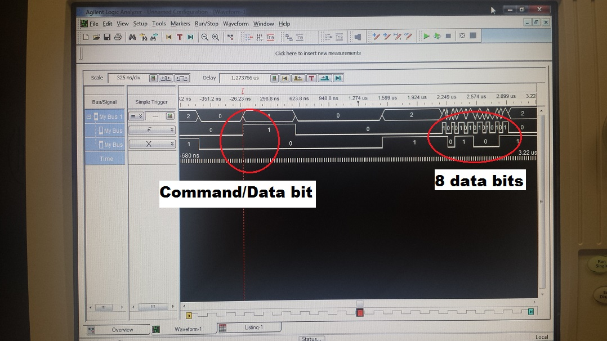

Lab3
====

Talking from the MSP430 to the Nokia LCD Screen

(This marks the end of the Mega Prelab.)
---------------------------------------------------------------
## Logic Analyzer
The answers to the logic analyzer section will be posted to GitHub along with the functionality code.
###Physical communication
Connect the Nokia 1202 Booster Pack to your TI Launch Pad.  Make sure that the buttons on the Booster Pack are pointed away from the USB connector (and on the same side of the board as the MSP430 buttons), just like in the following picture.
(Picture can be found on the ECE382 website under "Lab 3")

Download <a href="lab3.asm">lab3.asm</a> and build a project around the file.
Run the program and observe the output on the LCD every time you press the SW3 button.  It should look something like the following image after a few button presses. 
(Picture can be found on the ECE382 website under "Lab 3")

When SW3 is detected as being pressed and released (lines 56-62), the MSP430 generates 4 packets of data that are sent to the Nokia 1202 display, causing a vertical bar to be drawn. Complete the following table by finding the 4 calls to writeNokiaByte that generate these packets. In addition, scan the nearby code to determine the parameters being passed into this subroutine. Finally, write a brief description of what is trying to be accomplished by each call to writeNokiaByte.

|Line|R12|R13|Purpose|
|:-:|:-:|:-:|:-:|
| 66 | move #NOKIA_DATA | move #0xE7 | move #1 into r12 - cmd vs data, this is the pattern that is drawn 1110 0111 |
| 276 | #NOKIA_CMD | 1011 0000 | cmd, row number location on page  |
| 288 | #NOKIA_CMD | 0001 0000 | cmd,  |
| 294 | #NOKIA_CMD | mask upper bits to 0000 1111 | cmd, resets r13 (row) |
Configure the logic analyzer to capture the waveform generated when the SW3 button is pressed and released. Decode the data bits of each 9-bit waveform by separating out the MSB, which indicates command or data. Explain how the packet contents correspond to what was drawn on the display.  Be specific with the relationship between the data values and what and where the pixels are drawn

|Line|Command/Data|8-bit packet|
|:-:|:-:|:-:|
| 66 | Data | E7 |
| 276 | Commamd | B4 |
| 288 | Command | 10 |
| 294 | Command | 04 ||
Hint: in order to probe the signals while the LCD is connected to the LaunchPad, you will need to use the LaunchPad header pins with the probe hook grippers. Be careful when attaching and detaching the grippers to the pins, as they may easily bend and then no longer serve you well. Also, don't forget the ground pin! 
 
You will get a waveform similar to that shown below. Note that the command/data bit is significantly far away from the 8 data bits.  
 
Next, setup the Logic Analyzer to capture the RESET signal on a falling edge. Measure the duration that the RESET line is held low in the initNokia subroutine. Hint, the code to hold the reset line low can be found on lines 93-100. 
How many counts does the firmware loop count down from? 
Using the delay you just measured and the number of counts, calculate the amount of time each iteration of the delay loop consumes.

The reset counter counts down from 0xFFFF (65535) to zero. But, the delay from the measured reset is 6.544 micro seconds. So each loop is 6.544u/65535 or 0.998 nano seconds.

###Writing modes
The native write operation to the Nokia 1202 will overwrite any information that is was on the display with new information.  However, that may not be the best course of action in your application.  The new bits being added to the image may be merged using the AND, OR, XOR operators.  To do this treat a black pixel as a logic 1 and a white pixel as a logic 0.  The pixel values from the same locations are combined using a logical operator and placed at the corresponding location in the destination imaged.
Import the following image into a paint program and show the result of the operation between the two bits maps combined using the logic operator specified.

## Functionality
Required functionality: Create a block on the LCD that is 8x8 pixels.  The location of the block must be passed into the subroutine via r12 and r13.
A functionality: Move the 8-pixel block one block in the direction of the pressed button (up, down, left, right).
